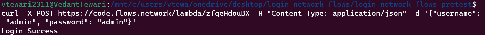
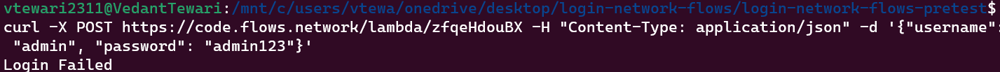

# Demonstrating a Rust-Based Login Handler

This project showcases a straightforward login handler implemented in Rust and deployed on the flows network. The objective of this project is to validate and compare a given username and password, which are included in a POST request. The request's body takes the form of a JSON object:

```json
{
    "username": "username",
    "password": "password"
}


```json
{
    "username": "username",
    "password": "password"
}
```

## Usage
You can interact with the login handler using the curl command-line tool. Here are a couple of examples:

### Successful Login
To simulate a successful login attempt where the username and password match, use the following curl command:

```bash
curl -X POST https://code.flows.network/lambda/zfqeHdouBX -H "Content-Type: application/json" -d '{"username": "admin", "password": "admin"}'
```


This will trigger a response indicating success.

### Failed Login
To simulate a failed login attempt where the password is incorrect, utilize the following curl command:

This will result in a response indicating failure.

```bash
curl -X POST https://code.flows.network/lambda/zfqeHdouBX -H "Content-Type: application/json" -d '{"username": "admin", "password": "admin123"}'
```

This will result in a response indicating failure.

